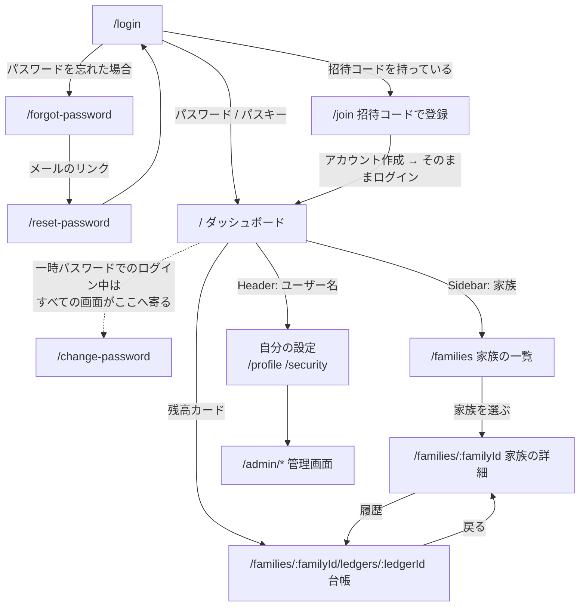
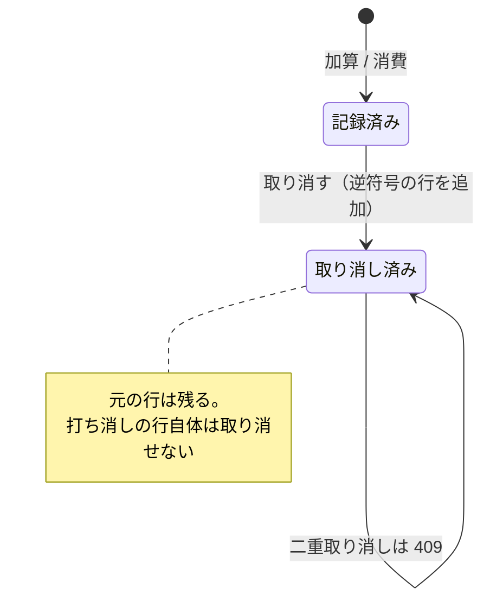

# frontend — 画面

React + TypeScript + Vite の SPA。ルーティングは `src/App.tsx`、レイヤー構成は
`docs/ARCHITECTURE.md`「フロントエンド」を参照。

表示の出し分けは 2 つの材料だけで決める。**ロール名では判断しない。**

| 材料                        | 出所                                         | 使いどころ                                     |
| --------------------------- | -------------------------------------------- | ---------------------------------------------- |
| scope                       | ログイン時のトークン（`useAuth().hasScope`） | ナビゲーションの項目、登録・記録フォームの有無 |
| `access_level` / `is_owner` | メンバーごとの API 応答                      | _その_ メンバーに対する変更・共有・削除の可否  |

scope だけでは「そのメンバーを触れるか」が決まらない（理由は ADR-0007）。両方が
揃ったときにだけ操作の入り口を出す。

## 画面幅による違い

`48rem`（768px）を境に振る舞いが変わる（`src/index.css` のメディアクエリ）。
画面は 1 種類で、DOM も同じ。狭い側でだけ次が加わる。

| 要素                          | 広い画面                 | 狭い画面                                                                                          |
| ----------------------------- | ------------------------ | ------------------------------------------------------------------------------------------------- |
| `Sidebar`                     | 本文の左に出たまま       | 画面外から滑り出す引き出し。ヘッダーの `☰` で開き、**項目を選ぶ・背景に触れる・Escape** で閉じる |
| 表                            | そのまま                 | `.table-scroll` で表だけを横に送る（ページ全体は横に動かない）                                    |
| `button` / `input` / `select` | 既定                     | 高さ 2.75rem 以上（指で押す的を 44px 以上にする）                                                 |
| 入力・フォーム                | 横並び（`.inline-form`） | 縦積み                                                                                            |
| 余白                          | 1.2rem                   | 0.9rem ＋ `env(safe-area-inset-*)`（ノッチ・ホームインジケータを避ける）                          |

入力欄の文字は 16px を下回らせない。下回ると iOS がフォーカス時に画面を拡大する。

## アイコン

`public/favicon.svg`・`pwa-192x192.png`・`pwa-512x512.png`・
`pwa-maskable-512x512.png`・`apple-touch-icon.png` は
`scripts/generate_app_icons.py` が生成する。手で編集しない
（SVG だけ直しても PNG は追随しない）。maskable はランチャー側で切り抜かれるため、
角丸のアイコンを流用せず、端まで塗って図柄をセーフゾーン（内側 80%）に収めた
別画像になっている。

アイコンの背景色は `index.html` の `theme-color` と `vite.config.ts` の
`theme_color`（起動画面・ステータスバーの色）と同じ `#1c80fa`。色を変えるときは
3 か所を揃える。画面の中で使う accent（`index.css` の `--accent`）とは別物。

### 参照 URL には版が付く

ファイル名は固定だが、`index.html`（`<link rel="icon">` / `apple-touch-icon`）と
manifest の `icons` が指す URL には、`vite.config.ts` がビルド時に中身の
ハッシュを `?v=` として付ける（`/pwa-192x192.png?v=61114774` のように）。

名前が同じままだと、絵柄を差し替えてもブラウザは手元のアイコンを使い続け、
インストール済みの PWA は manifest が変わっていないと見なして古い絵を出し続ける。
中身が変われば URL も変わるので、端末は新しい絵を取りに来る。版は生成された
ファイルから自動で決まるため、手で書き換える箇所は無い。

アイコンは Service Worker の precache に入れない（`workbox.globIgnores`）。
参照はすべて版付き URL で、precache の登録名（版なし）とは一致しないため。

## 画面一覧

`RequireAuth` の内側はログインが必要で、未ログインなら `/login` へ置き換え遷移する。
定義に無いパスはすべて `/` へ送る。

### ログイン不要

| パス               | 実装                             | 何をする画面か                                                                                     |
| ------------------ | -------------------------------- | -------------------------------------------------------------------------------------------------- |
| `/login`           | `pages/LoginPage.tsx`            | ユーザー名＋パスワード、またはパスキーでログイン。二要素認証が有効なら確認コードの入力に切り替わる |
| `/forgot-password` | `pages/ForgotPasswordPage.tsx`   | 再設定リンクの送信を申し込む（メールアドレスを設定しているアカウントのみ）                         |
| `/reset-password`  | `pages/ResetPasswordPage.tsx`    | メールのリンク（`?token=`）から新しいパスワードを設定する                                          |
| `/join`            | `pages/RedeemInvitationPage.tsx` | 招待コードでアカウントを作って家族へ加わる（子どもの入り口。ADR-0011）                             |

### ログイン必須

共通枠として `Header`（メニュー開閉・アプリ名・ユーザー名・ログアウト）、`Sidebar`、
`Footer` が付く。Sidebar の項目は scope を持つものだけが並ぶ（`components/Sidebar.tsx`）。
言語とテーマの切り替えは `/profile` にある（ヘッダーに置くと、狭い画面で 3 行になるため）。

| パス                                    | 実装                           | 必要な scope            | 何をする画面か                                                                          |
| --------------------------------------- | ------------------------------ | ----------------------- | --------------------------------------------------------------------------------------- |
| `/`                                     | `pages/AdminDashboardPage.tsx` | —                       | ログイン中のユーザーと API ドキュメントへのリンク。Sidebar には `dashboard:view` で出る |
| `/families`                             | `pages/FamiliesPage.tsx`       | `family:view`           | **家族の一覧。** 所属する家族。作成は `family:manage`、参加は招待コード                 |
| `/families/:familyId`                   | `pages/FamilyPage.tsx`         | `family:view`           | **家族の詳細。** 参加者と残高、子の追加・招待・一時パスワードの発行                     |
| `/families/:familyId/ledgers/:ledgerId` | `pages/LedgerPage.tsx`         | `point:view`            | **ポイント台帳。** 残高・履歴・加算・消費・訂正                                         |
| `/items`                                | `pages/ItemsPage.tsx`          | `item:view`             | 見本のアイテム CRUD（`bounded_contexts/example`）                                       |
| `/profile`                              | `pages/ProfilePage.tsx`        | —                       | 表示名とメールアドレスの変更・表示設定（言語 / テーマ）・システム管理への入口           |
| `/change-password`                      | `pages/ChangePasswordPage.tsx` | —                       | パスワード変更                                                                          |
| `/security`                             | `pages/SecurityPage.tsx`       | —                       | 二要素認証とパスキーの登録・解除                                                        |
| `/admin/users`                          | `pages/UsersPage.tsx`          | `user:manage`           | ユーザー管理                                                                            |
| `/admin/roles`                          | `pages/RolesPage.tsx`          | `role:manage`           | ロール管理                                                                              |
| `/admin/permissions`                    | `pages/PermissionsPage.tsx`    | `permission:manage`     | 権限一覧                                                                                |
| `/admin/config`                         | `pages/ConfigPage.tsx`         | `admin:system-settings` | システム設定                                                                            |
| `/admin/logs`                           | `pages/SystemLogsPage.tsx`     | `log:view`              | システムログ                                                                            |

「必要な scope」は Sidebar に項目が出る条件で、URL を直接開いたときの遮断は
API 側が行う（画面はエラーを表示する）。

## 遷移図

未ログインでログイン必須のパスを開くと `/login` へ、定義に無いパスは `/` へ送られる。
一時パスワードでログインしている間は、`/change-password` 以外のログイン必須の画面を
開いてもそこへ送られる（サーバー側も同じ関門を持つ。ADR-0011）。

## 家族とポイント台帳

共有は **家族への参加** によってのみ表す（ADR-0009）。メンバーを 1 人ずつ他の
アカウントへ共有する仕組みは無くなった。子ども本人もアカウントを持ち、
`role = child` の参加者として家族に所属する。

### 立場ごとに何ができるか

下の表は**家族の中での立場**の面だけを示す。実際に見え・行えるかは、列ごとの
scope も併せて必要（二段。ADR-0009）。

| 立場               | 家族が一覧に並ぶ | 残高・履歴    | 加算・消費・訂正 | 子の追加・招待  | 参加者を外す    |
| ------------------ | ---------------- | ------------- | ---------------- | --------------- | --------------- |
| 併せて必要な scope | `family:view`    | `point:view`  | `point:manage`   | `family:manage` | `family:manage` |
| `owner`            | ○                | ○（全ての子） | ○                | ○               | ○               |
| `parent`           | ○                | ○（全ての子） | ○                | ○               | ×               |
| `child`            | ○                | ○（自分だけ） | ×                | ×               | ×               |
| 所属していない人   | ×                | ×（404）      | ×                | ×               | ×               |

兄弟の残高・履歴は相互に参照できない。名前は見えるが、台帳への入り口と残高は
出ない（サーバーが `ledger_id` / `balance` を返さない）。

scope が足りなければ、○ の欄でもその操作は通らない（画面に入り口が出ず、API は
403）。既定のロールでは `manager` が 4 つすべてを持ち、`member` は
`family:view` + `point:view` だけ、`guest` はどれも持たない。子アカウントには
`member` が付くので、子が自分の台帳を変更できないのは scope と立場の両方による。

### 画面仕様: 家族の一覧（`/families`）

| 要素                                   | 出る条件        | 中身・操作                                                 |
| -------------------------------------- | --------------- | ---------------------------------------------------------- |
| 家族のリンク                           | 常時            | 家族名・自分の立場・参加人数                               |
| 作成フォーム                           | `family:manage` | 名前（必須）。作った人がその家族の `owner` になる          |
| 参加フォーム                           | 常時            | 招待コードを入力して加わる（すでにアカウントを持つ人向け） |
| 「まだどの家族にも参加していません。」 | 一覧が空        | —                                                          |

### 画面仕様: 家族の詳細（`/families/:familyId`）

出し分けはサーバーが返す `my_role` で決める（scope 名では判断しない）。

| 要素                       | 出る条件                                     | 中身・操作                                                             |
| -------------------------- | -------------------------------------------- | ---------------------------------------------------------------------- |
| 参加者の表                 | 常時                                         | 名前・立場・残高（見えない台帳は `—`）・履歴リンク                     |
| 「自分」の注記             | `is_me`                                      | —                                                                      |
| 「ログイン未設定」の注記   | `role = child` かつ `is_linked` が偽         | まだアカウントと結び付いていない                                       |
| 子の追加フォーム           | `my_role` が `owner` / `parent`              | 名前（必須）。追加と同時に台帳ができる                                 |
| 招待パネル                 | 同上                                         | 下記                                                                   |
| 一時パスワードの発行ボタン | 同上、かつ対象が `role = child` で紐付け済み | 平文はこの 1 度だけ画面に出る（ADR-0011）                              |
| 除名ボタン                 | `my_role` が `owner`、かつ自分以外           | 確認ダイアログの後に外す。記録が残っていると 409（`ledger_not_empty`） |

### 画面仕様: 招待パネル（`components/InvitationPanel.tsx`）

家族の詳細の中に埋め込まれる。`owner` 以外には現れない（家族の構成を変える操作）。

| 要素                    | 中身・操作                                                     | 呼ぶ API                                        |
| ----------------------- | -------------------------------------------------------------- | ----------------------------------------------- |
| 「もう 1 人の親を招待」 | `role = parent` のコードを発行                                 | `POST /api/families/{id}/invitations`           |
| 「〇〇 の招待コード」   | アカウント未設定の子ごとに 1 つ。`role = child` のコードを発行 | 同上                                            |
| 発行したコードの表示    | 発行直後だけ出る。**保存されているのはハッシュだけ**           | —                                               |
| 有効な招待の表          | 対象・有効期限・「取り消す」                                   | `GET` / `DELETE /api/families/{id}/invitations` |

一覧にコードは載らない（`code` は常に `null`）。失くしたら発行し直す。

### 画面仕様: ポイント台帳（`/families/:familyId/ledgers/:ledgerId`）

| 要素                                     | 出る条件                                                 | 中身・操作                                                             |
| ---------------------------------------- | -------------------------------------------------------- | ---------------------------------------------------------------------- |
| 残高                                     | 常時                                                     | 履歴の合計。負の値もそのまま出し、0 までの必要ポイントを添える         |
| 加算・消費フォーム                       | `can_modify`                                             | ポイント数（正の数）と理由。「加算する」「消費する」で符号を付ける     |
| 「このポイントは閲覧のみです。」         | `can_modify` が偽                                        | 変更の入り口は出さない                                                 |
| 履歴の表                                 | 常時                                                     | 日時（UTC をローカル表示に直す）・内容・増減（加算は `+`）・記録した人 |
| 「取り消す」ボタン                       | `can_modify`、かつ打ち消し済み・打ち消しレコードでない行 | 確認ダイアログの後に打ち消しの行を足す                                 |
| 「（取り消し済み）」「（打ち消し）」     | 対応する行                                               | 元の行は消えない。取り消し線を引いて対で見せる（ADR-0010）             |
| 「このポイントを読み込めませんでした。」 | 取得に失敗                                               | 見えない台帳（404）を直接開いた場合を含む                              |
| 「〜時点の情報です。」                   | 応答に `Date` ヘッダーがある（＝ほぼ常時）               | いつの残高・履歴かを示す。オフラインでは古いキャッシュの時刻になる     |

変更 UI を出すかはサーバーが返す `can_modify` の 1 つで決める。加算・消費は
`idempotency_key` を添えて送り、**成功するまで同じキーを使い回す**（通信が切れて
利用者がもう一度押しても、サーバー側で 1 行として扱われる）。

### オフライン閲覧（ADR-0015）

閲覧系の GET（`/api/auth/me`・家族一覧・家族詳細・台帳）は Service Worker が
network-first でキャッシュする（`vite.config.ts` の `runtimeCaching`、キャッシュ名
`offline-views`）。オンラインでは常にネットワークの応答を表示し、オフラインでは
最後に取得した内容を表示する。台帳画面の取得時刻がその古さを示す。

- 書き込み（加算・消費・打ち消し）と招待・理由の候補・管理系 API はキャッシュ
  しない。オフラインではエラーになる（候補が無くても記録フォームは出る）。
- キャッシュはユーザーが替わり得る節目（ログアウト・セッション失効・
  ログイン成功）で `services/api.ts` の `clearOfflineViewCache` が丸ごと削除する。

### 台帳の状態

行を消す遷移は無い。台帳は追記専用で、履歴からは何も消えない。

### エラーの表示

API はエラーコードだけを返し、文言は `i18n/{en,ja}.json` の `error.*` キーで引く
（`services/api.ts` の `errorMessageKey`）。家族・台帳まわりで出るもの:

| コード                             | 表示の意味                                           |
| ---------------------------------- | ---------------------------------------------------- |
| `family_access_denied`             | 届かない（未所属・立場不足・他家族。区別しない）     |
| `family_not_found`                 | 家族そのものが消えている                             |
| `ledger_not_found`                 | その台帳が存在しない                                 |
| `transaction_not_found`            | その記録が無い（他の台帳のものを指した場合を含む）   |
| `transaction_already_reversed`     | すでに取り消し済み                                   |
| `reversal_of_reversal_not_allowed` | 打ち消しの記録を取り消そうとした                     |
| `ledger_not_empty`                 | 記録の残っている参加者を外そうとした                 |
| `invitation_not_found`             | コードが無効・使用済み・期限切れ（3 つを区別しない） |
| `invitation_target_unavailable`    | その参加者にはすでにアカウントがある                 |
| `account_already_in_family`        | すでにその家族に参加している                         |
| `username_already_taken`           | そのユーザー名は使われている                         |
| `child_account_required`           | 一時パスワードの発行対象が子どもではない             |
| `membership_not_linked`            | まだアカウントを作っていない参加者を対象にした       |
| `password_change_required`         | 一時パスワードのまま他の操作をしようとした           |

API の仕様そのものは Swagger UI（`/docs`）・`/openapi.json`、サーバー側の規則は
`bounded_contexts/reward_points/README.md` を参照。
