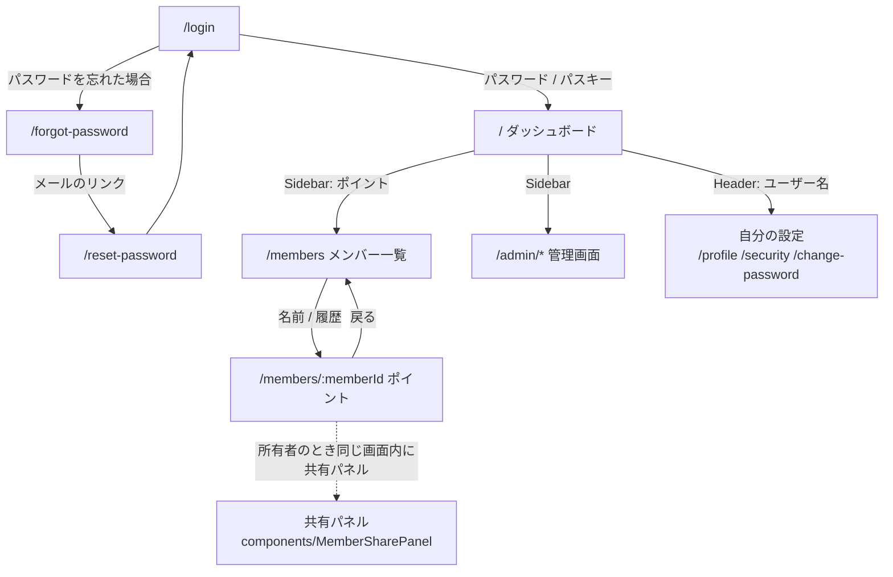
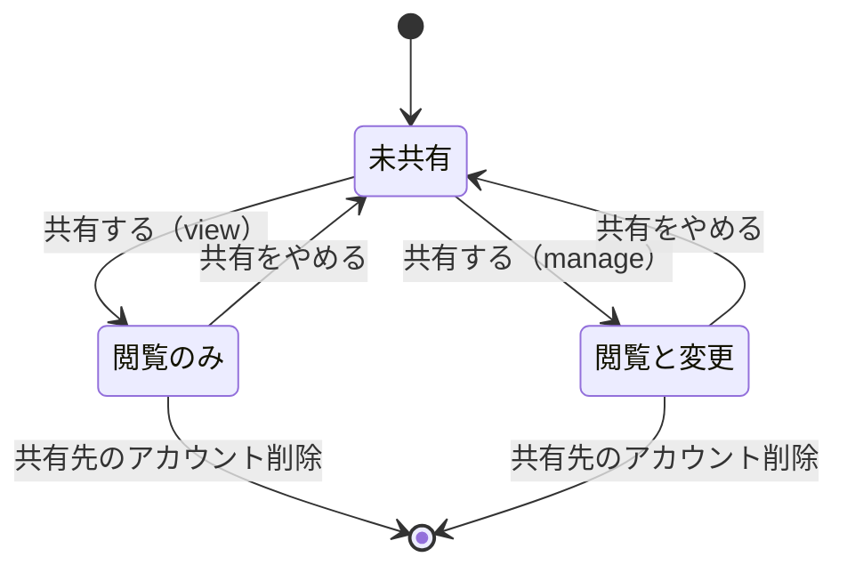

# frontend — 画面

React + TypeScript + Vite の SPA。ルーティングは `src/App.tsx`、レイヤー構成は
`docs/ARCHITECTURE.md`「フロントエンド」を参照。

表示の出し分けは 2 つの材料だけで決める。**ロール名では判断しない。**

| 材料                        | 出所                                         | 使いどころ                                     |
| --------------------------- | -------------------------------------------- | ---------------------------------------------- |
| scope                       | ログイン時のトークン（`useAuth().hasScope`） | ナビゲーションの項目、登録・記録フォームの有無 |
| `access_level` / `is_owner` | メンバーごとの API 応答                      | _その_ メンバーに対する変更・共有・削除の可否  |

scope だけでは「そのメンバーを触れるか」が決まらない（理由は ADR-0007）。両方が
揃ったときにだけ操作の入り口を出す。

## 画面一覧

`RequireAuth` の内側はログインが必要で、未ログインなら `/login` へ置き換え遷移する。
定義に無いパスはすべて `/` へ送る。

### ログイン不要

| パス               | 実装                           | 何をする画面か                                                                                         |
| ------------------ | ------------------------------ | ------------------------------------------------------------------------------------------------------ |
| `/login`           | `pages/LoginPage.tsx`          | メールアドレス＋パスワード、またはパスキーでログイン。二要素認証が有効なら確認コードの入力に切り替わる |
| `/forgot-password` | `pages/ForgotPasswordPage.tsx` | 再設定リンクの送信を申し込む                                                                           |
| `/reset-password`  | `pages/ResetPasswordPage.tsx`  | メールのリンク（`?token=`）から新しいパスワードを設定する                                              |

### ログイン必須

共通枠として `Header`（言語・テーマ・ユーザー名・ログアウト）、`Sidebar`、`Footer`
が付く。Sidebar の項目は scope を持つものだけが並ぶ（`components/Sidebar.tsx`）。

| パス                 | 実装                           | 必要な scope            | 何をする画面か                                                                          |
| -------------------- | ------------------------------ | ----------------------- | --------------------------------------------------------------------------------------- |
| `/`                  | `pages/AdminDashboardPage.tsx` | —                       | ログイン中のユーザーと API ドキュメントへのリンク。Sidebar には `dashboard:view` で出る |
| `/members`           | `pages/MembersPage.tsx`        | `member:view`           | **メンバー一覧。** 見られるメンバーと残高。登録は `member:manage`                       |
| `/members/:memberId` | `pages/MemberPointsPage.tsx`   | `point:view`            | **メンバーのポイント。** 残高・履歴・加算・消費、および共有の管理                       |
| `/items`             | `pages/ItemsPage.tsx`          | `item:view`             | 見本のアイテム CRUD（`bounded_contexts/example`）                                       |
| `/profile`           | `pages/ProfilePage.tsx`        | —                       | 自分の情報と付与されている scope                                                        |
| `/change-password`   | `pages/ChangePasswordPage.tsx` | —                       | パスワード変更                                                                          |
| `/security`          | `pages/SecurityPage.tsx`       | —                       | 二要素認証とパスキーの登録・解除                                                        |
| `/admin/users`       | `pages/UsersPage.tsx`          | `user:manage`           | ユーザー管理                                                                            |
| `/admin/roles`       | `pages/RolesPage.tsx`          | `role:manage`           | ロール管理                                                                              |
| `/admin/permissions` | `pages/PermissionsPage.tsx`    | `permission:manage`     | 権限一覧                                                                                |
| `/admin/config`      | `pages/ConfigPage.tsx`         | `admin:system-settings` | システム設定                                                                            |
| `/admin/logs`        | `pages/SystemLogsPage.tsx`     | `log:view`              | システムログ                                                                            |

「必要な scope」は Sidebar に項目が出る条件で、URL を直接開いたときの遮断は
API 側が行う（画面はエラーを表示する）。

## 遷移図

未ログインでログイン必須のパスを開くと `/login` へ、定義に無いパスは `/` へ送られる。
`/members` と `/members/:memberId` の間以外に、メンバー関連の画面遷移は無い
（共有の管理は別画面ではなくポイント画面の中に出る）。

## 子（メンバー）の共有

メンバーは「ポイントを貯める人」で、ログインアカウントとは別物。小さな子どもの
ように自分ではログインしないメンバーも登録できる。

### 共有の方法

**共有相手はメールアドレスで指定する。** 選択用のアカウント一覧は画面に出ない
（一覧を配る API を用意していないため。理由は ADR-0007）。

- 相手は**すでに登録済みで有効なアカウント**であること。未登録・無効なら
  `share_target_not_found` になる。招待メールは送らない — 相手が次にログインすると、
  そのメンバーが `/members` に並ぶようになる。
- 渡す範囲は **`view`（閲覧のみ）** か **`manage`（閲覧と変更）** の 2 択。
- **共有できるのは所有者（登録した人）だけ。** `manage` で共有された相手はポイントを
  記録できるが、共有を配り直すことも取り消すこともできない。
- 所有者自身は指定できない（`share_with_owner_not_allowed`）。同じ相手への二重共有も
  できない（`member_already_shared`）。範囲を変えたいときは、いったん解除してから
  共有し直す（更新の口は無い）。

メンバー登録時の `linked_user_email`（本人の紐付け）は共有とは別の仕組み。紐付いた
本人は自分の残高と履歴を見られるが、**変更はできない**。

### 立場ごとに何ができるか

| 立場                     | `/members` に並ぶ | 残高・履歴 | 加算・消費 | メンバー削除 | 共有の管理 |
| ------------------------ | ----------------- | ---------- | ---------- | ------------ | ---------- |
| 所有者                   | ○                 | ○          | ○          | ○            | ○          |
| `manage` で共有された人  | ○                 | ○          | ○          | ×            | ×          |
| `view` で共有された人    | ○                 | ○          | ×          | ×            | ×          |
| 本人（`linked_user_id`） | ○（自分だけ）     | ○          | ×          | ×            | ×          |
| どれでもない人           | ×                 | ×（404）   | ×          | ×            | ×          |

`member` ロールは `point:manage` を持たないため、本人は scope の面からも変更できない。

### 画面仕様: メンバー一覧（`/members`）

| 要素                         | 出る条件                                   | 中身・操作                                                                             |
| ---------------------------- | ------------------------------------------ | -------------------------------------------------------------------------------------- |
| 登録フォーム                 | `member:manage`                            | 名前（必須）と「本人のログイン用メールアドレス（任意）」。登録すると自分が所有者になる |
| 一覧の行                     | 常時                                       | 名前（ポイント画面へのリンク）・残高・履歴リンク                                       |
| 「自分」の注記               | `is_self`                                  | 自分が本人として紐付いたメンバー                                                       |
| 「ログインあり」の注記       | `has_linked_user`（かつ `is_self` でない） | 本人のメールアドレスは出さない（真偽のみ）                                             |
| 削除ボタン                   | `member:manage` **かつ** `is_owner`        | 確認ダイアログの後に削除。履歴もまとめて消える                                         |
| 「メンバーがまだいません。」 | 一覧が空                                   | 本人ログインで紐付けがまだ無い場合もここに来る                                         |

一覧の残高は API がまとめて返した値をそのまま出す（画面側で計算しない）。

### 画面仕様: メンバーのポイント（`/members/:memberId`）

| 要素                                     | 出る条件                                            | 中身・操作                                                 |
| ---------------------------------------- | --------------------------------------------------- | ---------------------------------------------------------- |
| 残高                                     | 常時                                                | 履歴の合計。負の値もそのまま出る                           |
| 加算フォーム                             | `point:manage` **かつ** `access_level === 'manage'` | ポイント数と理由                                           |
| 消費フォーム                             | 同上                                                | ポイント数と用途。残高不足でも拒まない                     |
| 「このポイントは閲覧のみです。」         | 上記を満たさないとき                                | 変更の入り口は出さない                                     |
| 履歴の表                                 | 常時                                                | 日時（UTC をローカル表示に直す）・内容・増減（加算は `+`） |
| 履歴の削除ボタン                         | 変更できるときだけ                                  | 打ち消しの行は作らず、行そのものを消す                     |
| 共有パネル                               | `member:manage` **かつ** `is_owner`                 | 下記                                                       |
| 「このポイントを読み込めませんでした。」 | 取得に失敗                                          | 到達できないメンバー（404）を直接開いた場合を含む          |

### 画面仕様: 共有パネル（`components/MemberSharePanel.tsx`）

ポイント画面の中に埋め込まれる。所有者以外には最初から現れない。

| 要素                             | 中身・操作                                                                        | 呼ぶ API                        |
| -------------------------------- | --------------------------------------------------------------------------------- | ------------------------------- |
| 共有フォーム                     | メールアドレス（必須）＋範囲（閲覧のみ／閲覧と変更、既定は閲覧のみ）→「共有する」 | `POST /api/members/{id}/shares` |
| 共有先の表                       | メールアドレス・範囲・「共有をやめる」                                            | `GET /api/members/{id}/shares`  |
| 「まだ誰にも共有していません。」 | 表が空のとき                                                                      | —                               |

- 「共有する」に成功すると入力欄を空にし、一覧を取り直して「保存しました。」を出す。
- 「共有をやめる」に確認ダイアログは無い（1 クリックで解除）。解除しても、その相手が
  それまでに記録したポイントの履歴は残る。
- 一覧の取得に失敗したときは空として描く（トーストは出さない）。

### 共有の状態

範囲を直接付け替える遷移は無い。`view` ↔ `manage` を変えるには解除してから共有し直す。

### エラーの表示

API はエラーコードだけを返し、文言は `i18n/{en,ja}.json` の `error.*` キーで引く
（`services/api.ts` の `errorMessageKey`）。共有まわりで出るもの:

| コード                         | 表示の意味                                           |
| ------------------------------ | ---------------------------------------------------- |
| `share_target_not_found`       | そのメールアドレスのアカウントが無い（未登録・無効） |
| `member_already_shared`        | すでにその相手へ共有済み                             |
| `share_with_owner_not_allowed` | 所有者自身を指定した                                 |
| `member_share_not_found`       | 解除しようとした共有がすでに無い                     |
| `member_not_found`             | 存在しないか、自分には共有されていない               |
| `member_access_denied`         | 到達はできるが、その操作の権限が無い                 |

API の仕様そのものは Swagger UI（`/docs`）・`/openapi.json`、サーバー側の規則は
`bounded_contexts/reward_points/README.md` を参照。
